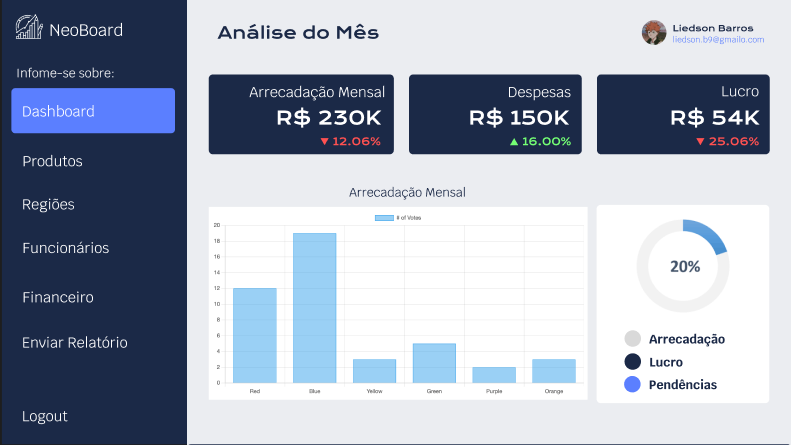
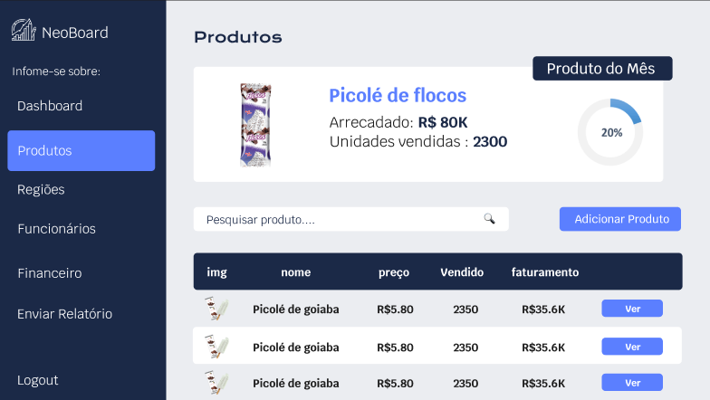
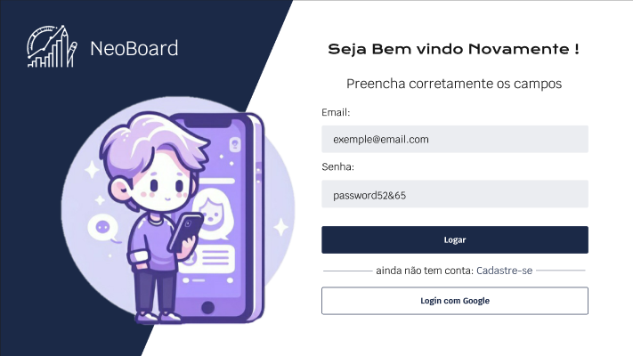

# NeoBoard - Dashboard Empresarial

NeoBoard é um dashboard empresarial inovador projetado para fornecer insights valiosos por meio de diversas sessões de dados. Com uma interface intuitiva e funcionalidades poderosas, o NeoBoard capacita empresas a tomar decisões informadas e estratégicas.

## Design

- **Figma:** [NeoBoard Figma](https://www.figma.com/file/FZsYI4I22unJ1Wg7HDTk96/NeoBoard?type=design&node-id=0-1&mode=design&t=tx0rR3XEPm7Oiu2d-0)

## Funcionalidades

- **Interface:**
  - Input que recebe arquivo Excel para importação de dados

- **Home:**
  - Vendas, clientes, despesas e cálculo de lucro (geral)
  - Gráficos: linhas (capital de período), pizza (venda dos produtos), colunas (vendas das regiões), cards (porcentagem de comparação com o mês anterior), ranking (produto e região), cotações, footer

- **Regiões:**
  - Vendas, clientes, despesas e cálculo de lucro

- **Produtos:**
  - Informação do produto (nome, marca, descrição, valor)
  - Números de vendas, capital bruto
  - Informações dos segmentos dos produtos (capital bruto, porcentagem do produto)
  - Histórico de vendas do mês, porcentagem de comparação com o mês anterior

- **Pagamentos:**
  - Gráfico geral das formas de pagamento
  - Detalhes para cartões (crédito e débito), PIX, boleto

## Testes

- Teste de carregamento de componentes HTML
- Teste de tipo de documento
- Envio de dados normal

## Extras

- Importação por arquivo

## NeoBoard Designer 2.0

### Produto, Funcionários e Região

- Gráfico de radar
- Substituição do azul alternado nos produtos por cinza e do azul escuro no header de títulos da lista de produtos
- Aumentar a height dos produtos listas

### Pagamentos

- Gráfico de bolha nos pagamentos

### Relatório

- Confirmações de envio diário dos relatórios
- Botão gerador de planilha
- Popup de formulário

## Backend NeoBoard

### Login e Autenticação

- Autenticação Auth Google e Email com Firebase
- Salvamento de sessão em localstorage
- Criptografia Bcrypt
- Sistema de confirmação de troca de senha

### Gerenciamento de Dados

- Mapa do banco de dados e interações
- Rota de informações (routers.js)
- Criar rotas da API e integração do banco PostgreSQL (server.js)
- Docker para rodar o PostgreSQL (docker-compose.yml)
- Classes de dados no (/modals)
- Linguagem Typescript

### Relatório

- Biblioteca para ler planilhas (.csv, .txt...)
- Envio de venda direto para o banco

### Gráficos

- [Chart.js](https://www.chartjs.org/)

# Conhecimentos utilizados:

  
  
  
  
  
  
  
  
  
  
          
  
  
  
       

## Autores

- [Liedson Barros 👑(Scrum Master)](https://github.com/LiedsonLB)
- [Pedro Lucas](https://github.com/PL251431)
- [Kaio Simeão](https://github.com/KaioSimeao)
- [Francisco Douglas](https://github.com/DouglaSantos777)

## Lista de Presença das Reuniões

[Google Sheets](https://docs.google.com/spreadsheets/d/1aLPvppBixNkQL8woJ6ycX3q-zcAxLUGQJkBnxcQIC94/edit?usp=sharing) - Reunião diária às 21h

## Repositório NeoBoard

[GitHub Repository](https://github.com/LiedsonLB/neoboard)

## Kanban

[Trello Kanban](https://trello.com/invite/b/icO9d5CG/ATTI88cb3da7dc14ce4b89a11b42a222a7bd37DDFF10/kanban-quadro-modelo)

## Releases

- Release v1.0❌
- Release v2.0❌
- Release v3.0❌

## Imagens do Projeto

### Dashboard Geral

### Dashboard Produtos

### Interface de Login e Cadastro 

## Licença

Este projeto está licenciado sob a [Licença MIT](LICENSE).